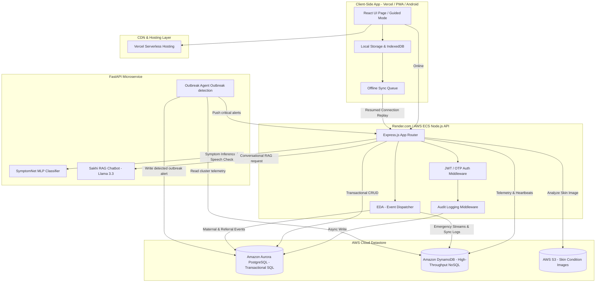

# System Architecture Diagram — SwasthAI Guardian Platform

This document describes the high-level architecture of the SwasthAI Guardian Platform, illustrating how offline-first clients, backend APIs, relational databases, NoSQL event stores, and AI microservices interact.

---

## 🏗️ Architectural Flow

---

## 📦 Component Roles

1. **Client Layer (Vercel / PWA / Android)**:
   - Built with React & Vite, hosted on Vercel. 
   - Uses an **Offline Event Replay Engine** powered by IndexedDB to log events (symptoms, pregnancies, emergencies) when offline and replay them automatically on reconnection.
   
2. **Backend API Service (Express.js)**:
   - Handles route validation, auth checks, and asynchronous audit logs.
   - Hosts the local **Event Dispatcher** which processes events like `symptom_submitted`, `emergency_triggered`, and `maternal_alert` out-of-band to keep route speeds fast.

3. **Data Layer (Aurora PostgreSQL + DynamoDB)**:
   - **Amazon Aurora PostgreSQL**: Stores core business relational tables (users, pregnancies, vaccinations, referrals, and district configs) ensuring ACID transactional compliance.
   - **Amazon DynamoDB**: Stores transient high-throughput event telemetry (symptoms logs, node sync queues, real-time emergency dispatches, and heartbeats) using TTL fields to automatically expire data after 7 days.

4. **AI Microservice (FastAPI + Python)**:
   - **SymptomNet**: A multi-layered MLP Neural Network that evaluates symptom inputs with a heuristic local rules model acting as a fallback if the network is busy/offline.
   - **Sakhi Chatbot**: A Retrieval-Augmented Generation (RAG) assistant running Llama-3.3-70B over an expanded 243-chunk multilingual clinical database.
   - **Outbreak Agent**: An asynchronous process that analyzes DynamoDB telemetry logs, groups them by village cluster, and automatically issues outbreak alerts into Aurora Postgres.
