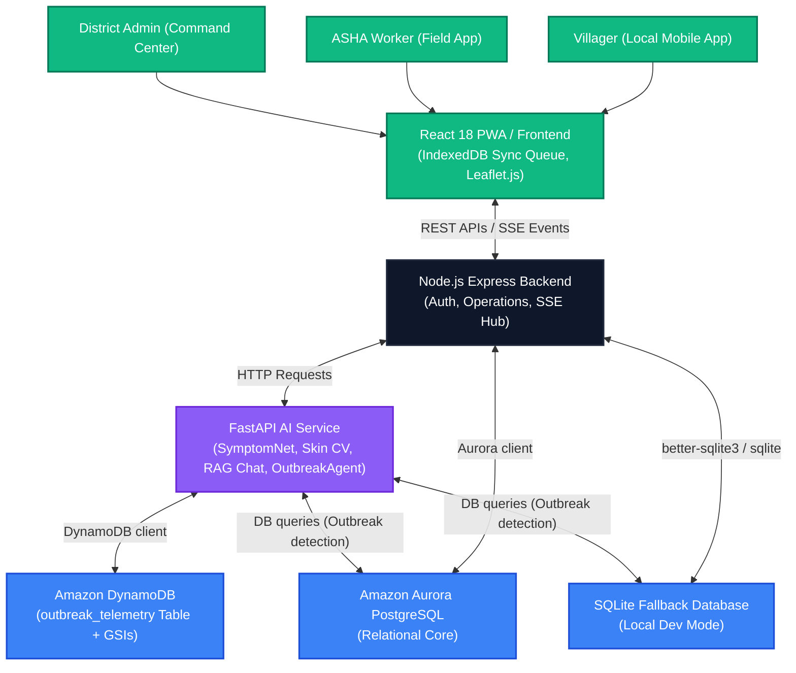

# SwasthAI Guardian Platform Architecture

SwasthAI Guardian is a National Rural Health Intelligence Platform built for scale, resilience, and offline-first dependability. It bridges the gap between rural citizens, field ASHA workers, and district healthcare administration.

## System Architecture

## Key Modules & Technologies

### 1. Offline-First Frontend Axis (PWA)
- **Framework**: React 18, Tailwind CSS, Framer Motion.
- **Offline Sync Queue**: Utilizes an IndexedDB-backed service worker queue. All diagnosis logs, pregnancy registrations, and child nutrition assessments sync automatically when connectivity returns.
- **Map & Boundaries**: Renders an interactive Leaflet.js map of Varanasi showing dynamic outbreak markers and live ASHA contact nodes.

### 2. Node.js Express Operations Hub
- **Authentication**: JWT access tokens (15m expiry) and sliding-window Refresh Tokens. Fallback local authentication using cached bcrypt hashes.
- **SSE Stream**: Server-Sent Events (SSE) stream live ambulance requests, telemetry changes, and outbreak alerts directly to the Admin dashboard.

### 3. Python AI & Analytical Service
- **Malnutrition Classifier**: Calculates WHO Weight-for-Height Z-score (WHZ) using linear interpolation on the 2006 WHO growth standards.
- **Skin Disease Detector**: Image processing using Pillow with a tone-normalized HSV skin-tone inclusion check.
- **Proactive Outbreak Prediction**: An `/predict/seasonal-risk` endpoint that maps villages to disease patterns using India's seasonal metrics to identify potential hot-spots.
- **Outbreak Agent**: Groq Llama-3.3-70b RAG-powered agent that analyzes clinical clusters to differentiate genuine outbreaks from background noise.

### 4. Hybrid Database Layer
- **Relational Core**: Amazon Aurora PostgreSQL as primary DB with an automatic fallback to local SQLite for zero-config development.
- **Telemetry Store**: Amazon DynamoDB storing outbreak telemetry records, queryable by disease and district indices using GSIs.
