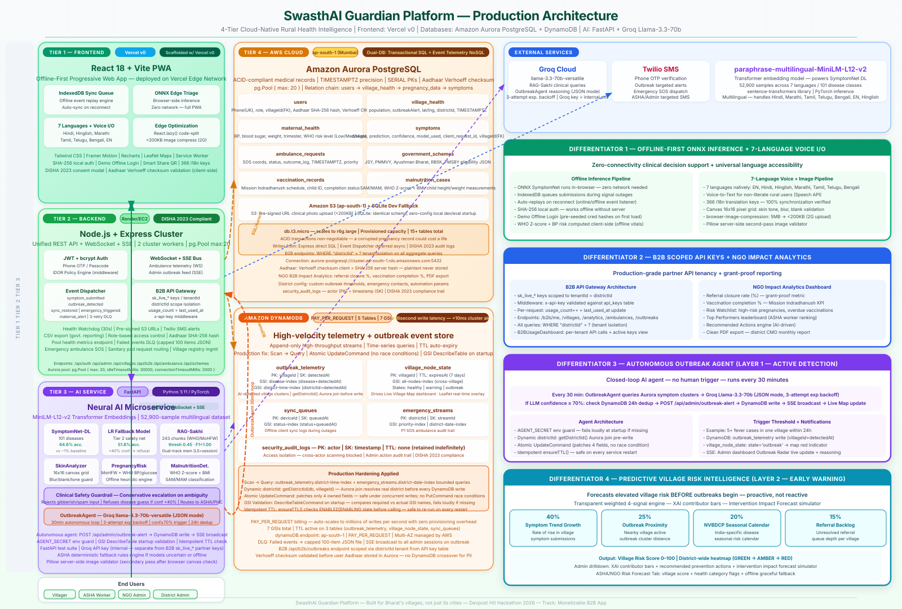

<p align="center">
  
</p>

<p align="center">
  <strong>Offline-First Rural Health Platform</strong><br/>
  3-Layer Microservice · Amazon Aurora PostgreSQL · Amazon DynamoDB
</p>

<p align="center">
  <a href="https://swasth-ai-guardian-platform.vercel.app"><b>Live Demo</b></a> ·
  <a href="DEPLOYMENT.md"><b>Deploy Guide</b></a> ·
  <a href="docs/judge_guide.md"><b>Judge's Guide</b></a> ·
  <a href="CHANGELOG.md"><b>Changelog</b></a>
</p>

<p align="center">
  
  
  
  
  
  
</p>

---

### The Problem → The Solution

| The Problem | The Solution |
|---|---|
| 650M+ rural Indians lack access to quality healthcare. The nearest doctor is often 20km away. | An offline-first PWA that works in zero-signal zones. ~4MB installable, QR-shareable, no app store needed. |
| ASHA workers manage 1,000+ families with paper registers. No data ever leaves the notebook. | Real-time telemetry flowing into Amazon Aurora PostgreSQL + DynamoDB. Every village, every visit, digitized. |
| Disease outbreaks are detected 2 weeks late — after the infection has spread across villages. | Autonomous AI agent scans clinical data every 30 min via Groq Llama-3.3-70b. SSE alerts hit admin dashboards instantly. |
| Maternal deaths from high-risk BP readings that never reach a doctor. | WHO risk classification computed in-browser. Critical alerts escalated via SSE to district CMO in real time. |
| Child malnutrition buried in monthly registers. No one audits, no one aggregates. | Offline WHO Z-score calculator. Auto-syncs to Aurora for district-wide SAM/MAM tracking. |
| Cloud apps are useless where internet doesn't reach. Rural sub-centers have zero connectivity. | ONNX runs in-browser. IndexedDB queues maternal, child, and SOS records. Auto-replays on reconnect. |
| District officers have no early warning system. They fly blind until people die. | Predictive 5-factor risk intelligence: per-village heatmap, XAI breakdown, prevention checklists. |

<br/>

> **Live AWS Proof** — Visit `/verify` to see real-time Aurora PostgreSQL connection health, all 5 DynamoDB tables with their 7 GSIs, TTL configs, item counts, and AI service latency. Every admin dashboard metric carries a provenance badge showing which database served it. No screenshots, no promises — live infrastructure, verifiable now.

<br/>

### Quick Reference

| Guide | What It Covers |
|---|---|
| [System Architecture](docs/system_architecture.md) | ERDs, DynamoDB access patterns, GSI schemas, TTL policies |
| [AI Architecture](docs/ai_architecture.md) | 5-fold CV results, RAG calibration (threshold 0.45, F1=1.00) |
| [Offline Sync Strategy](docs/offline_sync_strategy.md) | IndexedDB queues, idempotency, 3 conflict resolution rules |
| [Judge's Guide](docs/judge_guide.md) | Step-by-step walkthrough for B2B, technical, and impact tracks |
| [Deployment Guide](DEPLOYMENT.md) | Docker Compose, multi-worker scaling, cold-start tuning |
| [Setup Guide](docs/setup_guide.md) | Local dev with SQLite, env vars, one-command startup |

### Architecture & Infrastructure

Three independently deployable, fault-isolated services. If the AI service goes down, the backend keeps serving auth and records. If the backend is unreachable, the frontend keeps running symptom checks and SOS queuing locally.

| Layer | Platform | What It Handles | Production Details |
|---|---|---|---|
| **React PWA** | Vercel (edge) | ONNX offline inference (101 diseases, sub-ms), 7-language voice UI, IndexedDB queues, 20+ schemes cached | ~4MB PWA, lazy-loaded ONNX weights, service worker caching, QR sharing |
| **Express API** | Render (2 workers) | JWT + bcrypt auth, REST CRUD, SSE for real-time alerts, WebSocket for ambulance telemetry | `pg.Pool(20)` to Aurora, DynamoDB SDK with retry, health-checked boot |
| **FastAPI AI** | Render (isolated) | SymptomNet MLP (64.6%), LR fallback (71.1%), Sakhi RAG (243 chunks, F1=1.00), outbreak agent (30-min) | 3-tier fallback (DL → ML → heuristic), never silent, Groq Llama inference |
| **Nginx Proxy** | Docker Compose | Reverse proxy routing `/api/*` to backend, `/*` to frontend | Round-robin upstream, `max_fails=3`, 24h SSE timeout, cold-start tolerance |
| **Aurora PostgreSQL** | AWS ap-south-1 | Patient records, user auth, referrals, B2B analytics, scheme eligibility | ACID, SERIAL PKs, TIMESTAMPTZ, parameterized queries, `pg.Pool(20)` |
| **Amazon DynamoDB** | AWS ap-south-1 | Outbreak telemetry (90d TTL), sync queues (7d), emergency streams (30d), village heartbeats, audit logs | 5 tables, 7 GSIs, PAY_PER_REQUEST, KMS encryption, sub-ms writes |

---

### Key Features by Role

#### Villager

| # | Feature | What It Does |
|---|---|---|
| 1 | **AI Symptom Checker** | 101 disease classes, ONNX runs fully offline in-browser. Voice input in 7 languages. Severity triage with location recommendations. |
| 2 | **Ambulance SOS** | One-tap emergency dispatch with GPS. Queues to IndexedDB when offline. 60s cooldown prevents spam. Falls back to 108. |
| 3 | **Sakhi Women's Health AI** | Grounded RAG chatbot trained on 243 WHO/MoHFW clinical chunks. Full conversation memory. Falls back to fuzzy local KB offline. |
| 4 | **Camera Pad Requests** | Selfie → AI gender verification → GPS geocoding → SSE broadcast to ASHA with photo + map link. Privacy-first. |
| 5 | **Voice + 7 Languages** | Hindi, English, Marathi, Tamil, Telugu, Bengali, Hinglish. Speak symptoms, auto-fills forms, TTS reads results aloud. |

#### ASHA / NGO Worker

| # | Feature | What It Does |
|---|---|---|
| 1 | **Maternal Health** | Register pregnancies, track trimesters. WHO risk classification (BP, Hb, weight). Fully offline with IndexedDB queue. |
| 2 | **Child Nutrition** | WHO WHZ-score for SAM/MAM/Normal. Weight, height, MUAC. Zero internet required. |
| 3 | **Outbreak Alerts** | Real-time SSE notifications from the autonomous outbreak agent. Containment status, action plans. |
| 4 | **Smart Tasks** | AI-prioritized daily visits with route suggestions. Clinical notes, mark-as-done workflow. |
| 5 | **Impact Analytics** | Animated KPIs: pregnancies registered, children screened, emergencies handled. Sync queue with manual trigger. |

#### District Admin

| # | Feature | What It Does |
|---|---|---|
| 1 | **Command Center** | 15-tab district hub. Live KPI gauges, SSE telemetry, trend charts. Every metric shows which database served it. |
| 2 | **Outbreak Radar** | AI-driven detection every 30 min via Groq Llama. Simulate outbreaks, issue district alerts, confidence scores. |
| 3 | **Risk Intelligence** | 5-factor per-village risk model: symptom trend, outbreak proximity, seasonal calendar, referral backlog. XAI breakdown. |
| 4 | **B2B API Keys** | Create/revoke tenant-scoped `sk_live_*` keys. 3 permission levels. 6-district isolation. Usage tracking for billing. |
| 5 | **System Verification** | `/verify` panel: Aurora pool health, all 5 DynamoDB tables + 7 GSIs, AI latency. Live data, live queries. |

---

### B2B API Key System

Admins generate tenant-scoped API keys for partner NGOs and district health departments. Each key (`sk_live_` + 32 hex chars) locks to exactly one district — Varanasi data never leaks to Lucknow. Three permission levels (Read, ReadWrite, Admin) with per-request `usage_count` and `last_used_at` tracking, ready for consumption-based billing.

```bash
curl -H "x-api-key: sk_live_abc123..." \
  https://swasthai-guardian-platform-0jsb.onrender.com/api/b2b/me
```

| Endpoint | Response |
|---|---|
| `GET /api/b2b/me` | Key metadata, tenant district, permission level, usage stats |
| `GET /api/b2b/villages` | Village health data scoped to tenant (population, pregnancies, malnutrition, outbreak status) |
| `GET /api/b2b/analytics` | Aggregate counts — villages, pregnancies, symptoms, ambulance requests, users |
| `GET /api/b2b/ambulances` | Recent ambulance requests per tenant (7-day window, status, priority) |
| `GET /api/b2b/outbreaks` | DynamoDB outbreak telemetry per tenant (48-hour window, confidence scores) |

Multi-tenancy spans **6 districts**: Varanasi, Lucknow, Sehore, Bhopal, Indore, Pune. The admin API keys panel supports create, revoke, rotate, and copy-to-clipboard with per-tenant usage dashboards and animated counters.

---

### What's Under the Hood

| Component | How It Works | Why It Matters |
|---|---|---|
| **Outbreak Agent** | Polls PostgreSQL every 30 min for symptom clusters → classifies via Groq Llama-3.3-70b → writes to DynamoDB (TTL 90d) → pushes SSE alerts | Catches outbreaks weeks before manual reporting. 3-attempt backoff (1s, 2s, 4s). Simulated outbreaks from UI for drills. |
| **Edge AI** | 3-tier fallback: SymptomNet MLP (64.6%) → Logistic Regression (71.1%) → MoHFW/WHO heuristic (offline). ONNX runs in-browser sub-ms. Sakhi RAG: 243 chunks, threshold 0.45, F1=1.00 | Clinical decisions never silently fail. When Groq is down, the top KB chunk serves as fallback. Works with zero connectivity. |
| **Sync Engine** | 6 IndexedDB queues (maternal, child, ambulance, symptom, emergency, records). Client UUIDs for idempotency. Auto-drains on reconnect. | 3 conflict rules: Reject-Duplicate (clinical), LWW (ambulance), Accumulate (telemetry). SHA-256 offline password auth. |
| **Pad Request** | Selfie → `/api/detect-gender` → GPS reverse geocode → SSE to ASHA with photo + map link | 3-step camera-gated flow blocks abuse. ASHA sees thumbnail, verified badge, Google Maps link. Approve/deliver loop. |
| **Security** | DISHA 2023 consent, DPDP Act, Aadhaar hash (unique salt), AWS KMS encryption, Helmet.js, rate limiting (100/min/IP), Zod validation, PII redaction, 7-year audit trails | Production-grade compliance. Every layer has a security counterpart. |

---

<p align="center">
  <em>SwasthAI Guardian — Built for Bharat's villages, not just its cities.</em><br/>
  <strong>"We didn't build AI for doctors. We built it for the 600,000 villages that don't have one."</strong>
</p>
