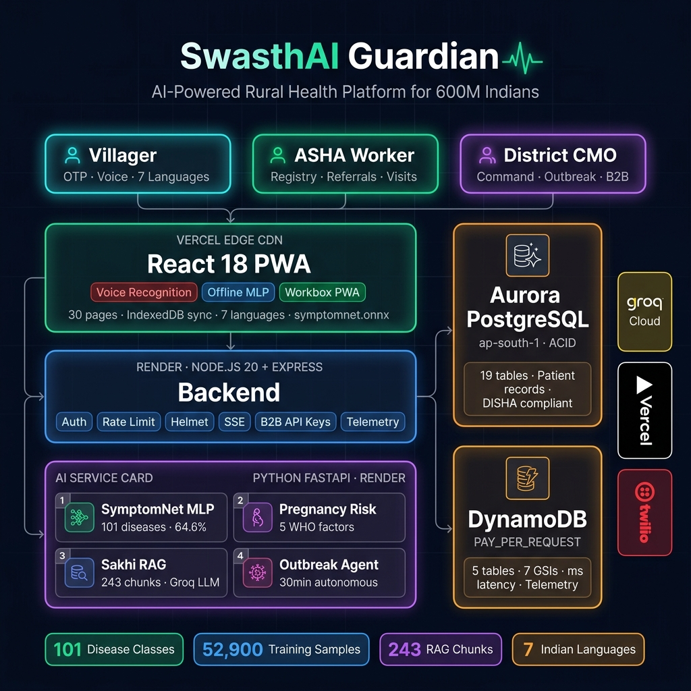

# SwasthAI Guardian — AI Health Platform for 600M Rural Indians

> *We didn't build AI for doctors. We built it for the 600,000 villages that don't have one.*

[](https://swasth-ai-guardian-platform.vercel.app) [](https://youtu.be/VCmt5OPmDGs) [](docs/judge_guide.md)

     

> **🏆 Tracks:** Monetizable B2B App · Most Impactful · Open Innovation  
> **👥 Team ID:** `team_ZuoCZ7nsvWVIrutn3eqmYdQD`  
> **🗓️ Hackathon:** H0: Hack the Zero Stack with Vercel v0 and AWS Databases

---

## 🌍 The Problem

| Problem | How We Solve It |
|---------|-----------------|
| ASHA workers manage 1,000+ families with paper registers | Real-time Aurora PostgreSQL + DynamoDB. Every village digitized. |
| Disease outbreaks detected 2 weeks late | Autonomous AI agent scans every 30 min via Groq Llama-3.3-70b. SSE alerts. |
| Cloud apps useless without internet | Offline MLP in-browser. IndexedDB queues auto-sync on reconnect. |
| District officers have no early warning system | 4-factor risk intelligence with per-village heatmap and XAI breakdown. |

> **💡 101 disease classes** (64.6% MLP vs ~1% random) · **7 languages** · **5 DynamoDB tables / 7 GSIs** · **52,900 training samples**

---

## 📖 Quick Reference

| Guide | What It Covers |
|-------|----------------|
| [System Architecture](docs/system_architecture.md) | ERDs, DynamoDB access patterns, GSI schemas, TTL policies |
| [AI Architecture](docs/ai_architecture.md) | 5-fold CV results, RAG calibration (threshold 0.45, F1=1.00) |
| [Offline Sync Strategy](docs/offline_sync_strategy.md) | IndexedDB queues, idempotency, conflict resolution |
| [Judge's Guide](docs/judge_guide.md) | Walkthrough for B2B, technical, and impact tracks |
| [Deployment Guide](docs/DEPLOYMENT.md) | Docker Compose, multi-worker scaling, cold-start tuning |
| [Setup Guide](docs/setup_guide.md) | Local dev with SQLite, env vars, one-command startup |
| [Repository Map](docs/repository_map.md) | Directory tree, file roles, naming conventions |
| [DynamoDB Tables](infra/dynamodb-tables.md) | Table schemas, PK/SK design, GSI access patterns |

---

## 🏗️ Architecture & Infrastructure



| Layer | Platform | What It Handles |
|-------|----------|-----------------|
| **React 18 PWA** | Vercel Edge CDN (v0) | Offline MLP (101 diseases, 64.6%), 7-language voice + TTS, IndexedDB queues, Workbox PWA |
| **Node.js API** | Render (multi-worker cluster) | JWT auth, Helmet OWASP, REST + SSE, B2B API keys (`sk_live_`), DynamoDB telemetry on every request |
| **FastAPI AI** | Render (separate service) | SymptomNet MLP (64.6%), LR fallback (71.1%), Sakhi RAG (243 chunks, F1=1.00), 30-min outbreak agent |
| **Aurora PostgreSQL** | AWS ap-south-1 | 19 tables — patient records, auth, referrals, welfare schemes, B2B analytics (ACID, SSL) |
| **DynamoDB** | AWS ap-south-1 | 5 tables, 7 GSIs — outbreak telemetry, sync queues, emergency streams, audit (PAY_PER_REQUEST) |

---

## ☁️ Why AWS

> **Design principle:** Hot-path writes → DynamoDB. Relational integrity → Aurora.

**Amazon Aurora PostgreSQL (ap-south-1):**
- ACID for medical records — pregnancy vitals, child nutrition, referrals, welfare schemes
- Relational joins across users, patients, schemes, and audit logs
- Parameterized queries prevent SQL injection
- Connection pool with live `/health/db` endpoint

**Amazon DynamoDB (ap-south-1, PAY_PER_REQUEST):**
- Infinite write scaling for outbreak telemetry and SOS streams
- Schema-less — symptom clusters evolve without migrations
- TTL auto-expire: 90d outbreaks, 365d SOS, 7yr immutable audit
- 7 GSIs across districts, villages, timestamps, and event types

---

## 👥 Key Features by Role

### 👨 Villager

| Feature | What It Does |
|---------|--------------|
| **AI Symptom Checker** | 101 disease classes, offline MLP, voice in 7 languages, severity triage |
| **🚑 Ambulance SOS** | One-tap GPS, offline queue, 60s cooldown, 108 fallback |
| **👩 Sakhi Women's Health AI** | RAG chatbot, 243 WHO/MoHFW chunks, conversation memory |
| **📸 Camera Pad Requests** | Selfie → gender verify → GPS → SSE to ASHA with photo + map |
| **🎤 Voice + 7 Languages** | Hindi, English, Marathi, Tamil, Telugu, Bengali, Hinglish |

### 🏥 ASHA / NGO Worker

| Feature | What It Does |
|---------|--------------|
| **Maternal Health** | Pregnancy tracking, WHO risk classification, fully offline |
| **Child Nutrition** | WHO Z-score (SAM/MAM/Normal), offline, MUAC tracking |
| **🚨 Outbreak Alerts** | Real-time SSE from autonomous agent, containment status |
| **Impact Analytics** | Animated KPIs, health scores, sync queue manager |

### 🏛️ District Admin

| Feature | What It Does |
|---------|--------------|
| **Command Center** | 15-tab hub, live SSE, provenance badges on every metric |
| **Outbreak Radar** | AI detection every 30min via Groq, simulate outbreaks |
| **Risk Intelligence** | 4-factor village risk model, XAI breakdown, prevention checklists |
| **🔑 B2B API Keys** | Tenant-scoped keys, 3 permission levels, 6-district isolation |
| **📊 Live Infra Monitor** | Real-time Aurora + DynamoDB health, GSIs, AI latency |

---

## 🔑 B2B API Key System

Production-grade B2B gateway for NGOs and district health departments:

- `sk_live_` + 32 hex keys, locked to 1 of 6 districts
- 3 permission levels — Read, ReadWrite, Admin
- 5 REST endpoints — `/api/b2b/me`, `/api/b2b/villages`, `/api/b2b/analytics`, `/api/b2b/ambulances`, `/api/b2b/outbreaks`
- Usage tracking + SQL tenant isolation (`WHERE "districtId" = ?`)
- Admin panel: create, revoke, rotate, copy-to-clipboard

```bash
curl -H "x-api-key: sk_live_abc123..." \
  https://swasthai-guardian-platform-0jsb.onrender.com/api/b2b/me
```

### 💰 Pricing Model

| Tier | Price | What's Included |
|------|-------|-----------------|
| **District Starter** | ₹18,800/mo (~$199) | Up to 50 villages, offline vitals, basic RAG, weekly CSV exports |
| **District Command** | ₹37,700/mo (~$399) | Up to 250 villages, outbreak agent, SSE dashboards, 7-language support |
| **State Enterprise** | Custom | Unlimited villages, dedicated Aurora pool, ABDM sync, SLA |

> **💡 Revenue:** Partners pay for programmatic data access via `sk_live_` keys — village analytics, outbreak telemetry, ambulance streams. Self-sustaining beyond hackathon.

---

## 🔬 What's Under the Hood

| Component | How It Works | Why It Matters |
|-----------|--------------|----------------|
| **Outbreak Agent** | Polls PostgreSQL every 30min → Groq Llama classifies → writes to DynamoDB (TTL 90d) → SSE alerts | **Catches outbreaks weeks before manual reporting** |
| **Edge AI** | 3-tier fallback: DL (64.6%) → LR (71.1%) → offline WHO heuristics | **Zero-internet symptom checker. Never silently fails.** |
| **Sync Engine** | 4 IndexedDB queues, UUID idempotency, auto-drain on reconnect | **3 conflict rules: Reject-Duplicate, LWW, Accumulate** |
| **Pad Request** | Selfie → gender verify → GPS → SSE to ASHA with photo + map | **Privacy-first welfare. Blocks male misuse.** |
| **Security** | DISHA 2023, DPDP Act, Aadhaar hash, KMS, Helmet, rate limiting, Zod, PII redaction | **Production-grade compliance. Every layer in code.** |

---

## 👥 Team

- **Divyansh Gupta (Team Leader):** AI/ML, Backend, AWS Cloud, API Design
- **Tejshvee Yerpurwad:** Frontend, UX, Localization, Grounded RAG

*Built for H0 Hackathon 2026 · Team ID: `team_ZuoCZ7nsvWVIrutn3eqmYdQD`*

---

*1.4 million ASHA workers. 600,000 villages. 650 million lives. Powered by Amazon Aurora PostgreSQL + Amazon DynamoDB on Vercel.*

**SwasthAI Guardian** — *We didn't build AI for doctors. We built it for the 600,000 villages that don't have one.*

[Judge's Guide](docs/judge_guide.md) · [Devpost](https://devpost.com/software/swasthai-guardian)
