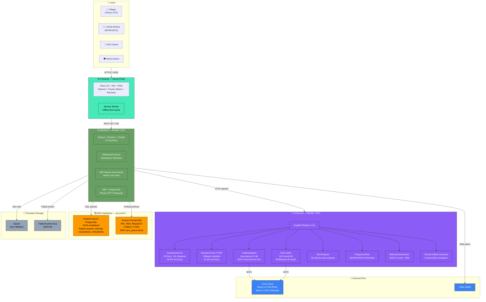

```mermaid
flowchart TB
    subgraph USERS["👥 Users"]
        V["📱 Villager<br/>(Phone OTP)"]
        A["👩‍⚕️ ASHA Worker<br/>(9876543211)"]
        N["🏢 NGO Admin"]
        AD["🛡️ District Admin"]
    end

    subgraph FRONTEND["🌐 Frontend — Vercel (Free)"]
        REACT["React 18 + Vite + PWA<br/>Tailwind + Framer Motion + Recharts"]
        PWA["Service Worker<br/>Offline-first Cache"]
    end

    subgraph BACKEND["⚙️ Backend — Render / EC2"]
        NODE["Node.js + Express + Cluster<br/>(12 workers)"]
        WS["WebSocket Server<br/>Ambulance Telemetry"]
        SSE["SSE Server-Sent Events<br/>Admin Live Feed"]
        AUTH["JWT + bcrypt Auth<br/>Phone OTP / Passcode"]
    end

    subgraph AISERVICE["🧠 AI Service — Render / EC2"]
        FASTAPI["FastAPI (Python 3.11)"]
        SYMPTOMNET["SymptomNet-DL<br/>PyTorch, 101 diseases<br/>64.6% accuracy"]
        RF["RandomForest-TFIDF<br/>Fallback classifier<br/>51.8% accuracy"]
        RAG["RAG-Sakhi<br/>243 chunk KB<br/>Multilingual (6 langs)"]
        OUTBREAK["OutbreakAgent<br/>Groq llama-3.1-8b<br/>30min autonomous loop"]
        SKIN["SkinAnalyzer<br/>On-device pixel analysis"]
        PREGNANCY["PregnancyRisk<br/>MoHFW WHO thresholds"]
        MALNUTRITION["MalnutritionDetector<br/>WHO Z-score + BMI"]
        GUARDRAIL["Clinical Safety Guardrail<br/>Conservative escalation"]
    end

    subgraph DATABASES["🗄️ AWS Databases — ap-south-1"]
        AURORA["Amazon Aurora PostgreSQL<br/>ACID compliance<br/>Patient records, referrals,<br/>vaccinations, ambulances"]
        DYNAMODB["Amazon DynamoDB<br/>PAY_PER_REQUEST<br/>5 tables, 4 GSIs<br/>256K sync_queue items"]
    end

    subgraph EXTERNAL["🔗 External APIs"]
        GROQ["Groq Cloud<br/>llama-3.3-70b (RAG)<br/>llama-3.1-8b (Outbreak)"]
        TWILIO["Twilio (SMS)"]
    end

    subgraph STORAGE["💾 Persistent Storage"]
        SQLITE["SQLite<br/>(Dev fallback)"]
        DLQ["Failed Events DLQ<br/>JSON file"]
    end

    %% ── Frontend to Backend ──
    USERS -->|"HTTPS / WSS"| FRONTEND
    FRONTEND -->|"REST API / WS"| BACKEND

    %% ── Backend to Databases ──
    BACKEND -->|"SQL queries"| AURORA
    BACKEND -->|"Put/Query/Scan"| DYNAMODB
    BACKEND -->|"Dev only"| SQLITE
    BACKEND -->|"Failed events"| DLQ

    %% ── Backend to AI ──
    BACKEND -->|"HTTP /api/ai/*"| AISERVICE

    %% ── AI Service internals ──
    FASTAPI --> SYMPTOMNET
    FASTAPI --> RF
    FASTAPI --> RAG
    FASTAPI --> OUTBREAK
    FASTAPI --> SKIN
    FASTAPI --> PREGNANCY
    FASTAPI --> MALNUTRITION
    FASTAPI --> GUARDRAIL
    OUTBREAK -->|"query"| GROQ
    RAG -->|"query"| GROQ

    %% ── External ──
    BACKEND -->|"SMS alerts"| TWILIO

    %% ── Styles ──
    classDef aws fill:#FF9900,color:#000,stroke:#232F3E
    classDef frontend fill:#46E9B8,color:#000,stroke:#333
    classDef backend fill:#68A063,color:#fff,stroke:#333
    classDef ai fill:#8B5CF6,color:#fff,stroke:#333
    classDef external fill:#3B82F6,color:#fff,stroke:#333
    classDef storage fill:#94A3B8,color:#000,stroke:#333
    class FRONTEND,PWA frontend
    class BACKEND,NODE,WS,SSE,AUTH backend
    class AISERVICE,FASTAPI,SKIN ai
    class SYMPTOMNET,RF,RAG,OUTBREAK,PREGNANCY,MALNUTRITION,GUARDRAIL ai
    class AURORA,DYNAMODB aws
    class GROQ,TWILIO external
    class SQLITE,DLQ storage
```
