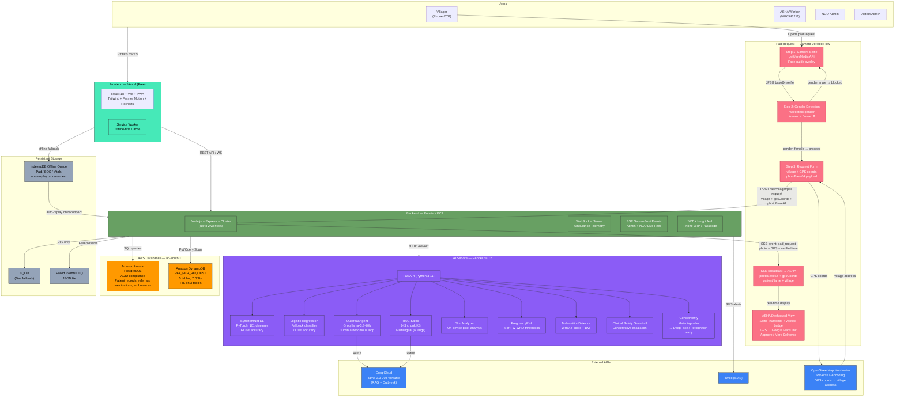

```mermaid
flowchart TB
    subgraph USERS["Users"]
        V["Villager<br/>(Phone OTP)"]
        A["ASHA Worker<br/>(9876543211)"]
        N["NGO Admin"]
        AD["District Admin"]
    end

    subgraph FRONTEND["Frontend — Vercel (Free)"]
        REACT["React 18 + Vite + PWA<br/>Tailwind + Framer Motion + Recharts"]
        PWA["Service Worker<br/>Offline-first Cache"]
    end

    subgraph BACKEND["Backend — Render / EC2"]
        NODE["Node.js + Express + Cluster<br/>(up to 2 workers)"]
        WS["WebSocket Server<br/>Ambulance Telemetry"]
        SSE["SSE Server-Sent Events<br/>Admin + NGO Live Feed"]
        AUTH["JWT + bcrypt Auth<br/>Phone OTP / Passcode"]
    end

    subgraph AISERVICE["AI Service — Render / EC2"]
        FASTAPI["FastAPI (Python 3.11)"]
        SYMPTOMNET["SymptomNet-DL<br/>PyTorch, 101 diseases<br/>64.6% accuracy"]
        RF["Logistic Regression<br/>Fallback classifier<br/>71.1% accuracy"]
        RAG["RAG-Sakhi<br/>243 chunk KB<br/>Multilingual (6 langs)"]
        OUTBREAK["OutbreakAgent<br/>Groq llama-3.3-70b<br/>30min autonomous loop"]
        SKIN["SkinAnalyzer<br/>On-device pixel analysis"]
        PREGNANCY["PregnancyRisk<br/>MoHFW WHO thresholds"]
        MALNUTRITION["MalnutritionDetector<br/>WHO Z-score + BMI"]
        GUARDRAIL["Clinical Safety Guardrail<br/>Conservative escalation"]
        GENDERDETECT["GenderVerify<br/>/detect-gender<br/>→ DeepFace / Rekognition ready"]
    end

    subgraph PADFLOW["Pad Request — Camera Verified Flow"]
        CAM["Step 1: Camera Selfie<br/>getUserMedia API<br/>Face-guide overlay"]
        VERIFY["Step 2: Gender Detection<br/>/api/detect-gender<br/>female ✓ / male ✗"]
        PADFORM["Step 3: Request Form<br/>village + GPS coords<br/>photoBase64 payload"]
        SSEBROADCAST["SSE Broadcast → ASHA<br/>photoBase64 + gpsCoords<br/>patientName + village"]
        ASHAVIEW["ASHA Dashboard View<br/>Selfie thumbnail + verified badge<br/>GPS → Google Maps link<br/>Approve / Mark Delivered"]
    end

    subgraph DATABASES["AWS Databases — ap-south-1"]
        AURORA["Amazon Aurora PostgreSQL<br/>ACID compliance<br/>Patient records, referrals,<br/>vaccinations, ambulances"]
        DYNAMODB["Amazon DynamoDB<br/>PAY_PER_REQUEST<br/>5 tables, 7 GSIs<br/>TTL on 3 tables"]
    end

    subgraph EXTERNAL["External APIs"]
        GROQ["Groq Cloud<br/>llama-3.3-70b-versatile<br/>(RAG + Outbreak)"]
        TWILIO["Twilio (SMS)"]
        NOMINATIM["OpenStreetMap Nominatim<br/>Reverse Geocoding<br/>GPS coords → village address"]
    end

    subgraph STORAGE["Persistent Storage"]
        SQLITE["SQLite<br/>(Dev fallback)"]
        DLQ["Failed Events DLQ<br/>JSON file"]
        IDB["IndexedDB Offline Queue<br/>Pad / SOS / Vitals<br/>auto-replay on reconnect"]
    end

    %% ── Frontend to Backend ──
    USERS -->|"HTTPS / WSS"| FRONTEND
    FRONTEND -->|"REST API / WS"| BACKEND

    %% ── Camera Verified Pad Request Flow ──
    V -->|"Opens pad request"| CAM
    CAM -->|"JPEG base64 selfie"| VERIFY
    VERIFY -->|"gender: female → proceed"| PADFORM
    VERIFY -->|"gender: male → blocked"| CAM
    PADFORM -->|"GPS coords"| NOMINATIM
    NOMINATIM -->|"village address"| PADFORM
    PADFORM -->|"POST /api/villager/pad-request<br/>village + gpsCoords + photoBase64"| NODE
    NODE -->|"SSE event: pad_request<br/>photo + GPS + verified:true"| SSEBROADCAST
    SSEBROADCAST -->|"real-time display"| ASHAVIEW

    %% ── Backend to Databases ──
    BACKEND -->|"SQL queries"| AURORA
    BACKEND -->|"Put/Query/Scan"| DYNAMODB
    BACKEND -->|"Dev only"| SQLITE
    BACKEND -->|"Failed events"| DLQ

    %% ── Backend to AI ──
    BACKEND -->|"HTTP /api/ai/*"| AISERVICE

    %% ── AI Service internals ──
    FASTAPI --> SYMPTOMNET
    FASTAPI --> RF
    FASTAPI --> RAG
    FASTAPI --> OUTBREAK
    FASTAPI --> SKIN
    FASTAPI --> PREGNANCY
    FASTAPI --> MALNUTRITION
    FASTAPI --> GUARDRAIL
    FASTAPI --> GENDERDETECT
    OUTBREAK -->|"query"| GROQ
    RAG -->|"query"| GROQ

    %% ── Offline Queue ──
    FRONTEND -->|"offline fallback"| IDB
    IDB -->|"auto-replay on reconnect"| BACKEND

    %% ── External ──
    BACKEND -->|"SMS alerts"| TWILIO

    %% ── Styles ──
    classDef aws fill:#FF9900,color:#000,stroke:#232F3E
    classDef frontend fill:#46E9B8,color:#000,stroke:#333
    classDef backend fill:#68A063,color:#fff,stroke:#333
    classDef ai fill:#8B5CF6,color:#fff,stroke:#333
    classDef external fill:#3B82F6,color:#fff,stroke:#333
    classDef storage fill:#94A3B8,color:#000,stroke:#333
    classDef padflow fill:#FB7185,color:#fff,stroke:#BE123C
    class FRONTEND,PWA frontend
    class BACKEND,NODE,WS,SSE,AUTH backend
    class AISERVICE,FASTAPI,SKIN,GENDERDETECT ai
    class SYMPTOMNET,RF,RAG,OUTBREAK,PREGNANCY,MALNUTRITION,GUARDRAIL ai
    class AURORA,DYNAMODB aws
    class GROQ,TWILIO,NOMINATIM external
    class SQLITE,DLQ,IDB storage
    class CAM,VERIFY,PADFORM,SSEBROADCAST,ASHAVIEW padflow
```
