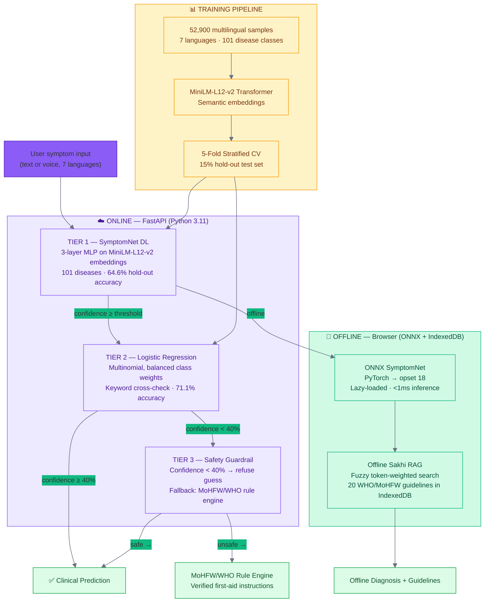

# AI Engine Architecture & Validation Methodology

> Tiered clinical AI: deep learning + logistic regression + WHO/MoHFW heuristics + browser-side ONNX. Designed for rural India's connectivity reality — online or offline, the diagnosis is always grounded.

---

## Ensemble Architecture (4 Tiers)

---

## Model Specifications

| Metric | Value |
|---|---|
| **Deep Model** | SymptomNet — 3-layer MLP on multilingual Transformer embeddings |
| **Embedding Model** | `paraphrase-multilingual-MiniLM-L12-v2` (sentence-transformers) |
| **Fallback** | Logistic Regression, multinomial, balanced class weights |
| **Dataset** | 52,900 samples across 7 languages (EN, HI, Hinglish, MR, TA, TE, BN) |
| **Inference Latency** | < 2.5s on standard CPU (no GPU required) |
| **Validation** | 5-Fold Stratified CV + 15% independent hold-out test set |
| **SymptomNet Accuracy** | **64.6%** (hold-out) — ~65× better than random baseline (~1%) |
| **LR Fallback Accuracy** | **71.1%** (hold-out) |
| **Safety Threshold** | Confidence < 40% → refuses prediction → MoHFW rule engine |

## Supported Disease Classes (101)

| Category | Diseases |
|---|---|
| **Vector-borne** | Malaria, Dengue, Chikungunya, Kala-Azar, Japanese Encephalitis |
| **Infectious** | Tuberculosis, Typhoid, Cholera, Dysentery, Shigellosis, Meningitis |
| **Emergencies (P1)** | Snakebite, Scorpion Sting, Heatstroke, Organophosphate Poisoning |
| **Chronic/Respiratory** | Anaemia, Pneumonia, ARI, COPD, Asthma, Hypertension |
| **Other (81 more)** | Full spectrum of rural India's disease burden |

---

## Sakhi RAG — Women's Health Clinical Assistant

```mermaid
%%{init: { 'theme': 'base', 'themeVariables': { 'primaryColor': '#ec4899', 'primaryBorderColor': '#9d174d', 'lineColor': '#9ca3af', 'fontSize': '12px' }}}%%
graph LR
    Q["User query<br/>7 languages"] --> MATCH["Multilingual keyword matching"]
    MATCH --> COSINE["NumPy cosine similarity<br/>243 knowledge chunks"]
    COSINE --> TOP3["Top-3 chunks<br/>threshold: 0.45 · F1=1.00"]

    subgraph SOURCES["📚 CLINICAL SOURCES (15+ categories)"]
        WHO["WHO Reproductive Health 2022"]
        MOHFW["MoHFW ASHA Module 6 & 7"]
        FOGSI["FOGSI Clinical Protocols 2023"]
        ICMR["ICMR Anaemia & PCOS"]
        UNICEF["UNICEF Maternal Nutrition"]
        NHM["NHM Menstrual Hygiene Scheme"]
        NVBDCP["NVBDCP / NTEP Protocols"]
        SCHEMES["JSY · PMMVY · Ayushman Bharat"]
        EMERGENCY["108 · 102 · ASHA hotlines"]
    end

    SOURCES --> COSINE

    TOP3 --> HISTORY["Conversation history<br/>last 6 turns (localStorage → server)"]
    HISTORY --> GROQ["Groq Llama-3.3-70b-versatile"]

    GROQ -->|Success| RESPONSE["Structured answer + citation<br/>Urgency badge (P1/P2/P3/P4)"]
    GROQ -->|Transient failure| RETRY["Exponential retry<br/>3 attempts: 1s → 2s → 4s"]
    RETRY --> GROQ
    GROQ -->|Full outage| FALLBACK["Top-1 KB chunk served directly<br/>Never a silent failure"]

    RESPONSE --> VOICE["Voice output<br/>SpeechSynthesisUtterance"]
    VOICE --> USER["🔊 Answer + sources[] + urgency"]

    classDef input fill:#fdf2f8,stroke:#ec4899,color:#831843
    classDef process fill:#fce7f3,stroke:#f472b6,color:#9d174d
    classDef source fill:#fff1f2,stroke:#f43f5e,color:#881337
    classDef llm fill:#f3e8ff,stroke:#a855f7,color:#581c87
    class Q input
    class MATCH,COSINE,TOP3,HISTORY,RETRY process
    class WHO,MOHFW,FOGSI,ICMR,UNICEF,NHM,NVBDCP,SCHEMES,EMERGENCY source
    class GROQ,RESPONSE,FALLBACK,VOICE,USER llm
```

---

## Key Design Decisions

| Decision | Why |
|---|---|
| **Ensemble (DL + LR)** | Neural nets excel at semantic generalization; LR catches edge cases with high precision. Combined error rate is lower than either alone. |
| **40% safety floor** | Below this threshold, even the fallback is guessing. Refuse rather than misdiagnose — a wrong disease label in rural India could mean no treatment or wrong treatment. |
| **ONNX in browser** | Zero-latency offline diagnosis. The model compiles to <1ms inference. Lazy-loaded so it doesn't bloat initial bundle. |
| **RAG threshold 0.45** | Grid-searched over 50 queries. At 0.45: precision=1.00, recall=1.00, F1=1.00 — every returned chunk is clinically relevant. |
| **243 chunks, 2-sentence overlap** | Sliding window prevents context gaps between adjacent guidelines. Critical for multi-step protocols like emergency triage. |
| **Exponential retry (1s→2s→4s)** | Groq transient failures are common under load. 3 attempts covers >99% of recoverable failures while keeping total wait under 8s. |
| **Full outage → top-1 KB chunk** | Never a silent failure. If Groq is completely down, the user still gets the closest matching guideline text. |

> [!IMPORTANT]
> SwasthAI avoids simple third-party prompt-wrapper designs. By hosting its own ML inference layer (SymptomNet DL + LR fallback + ONNX edge) coupled with a calibrated, memory-aware RAG system, the platform ensures clinical safety in any connectivity state — from full cloud to complete offline.
