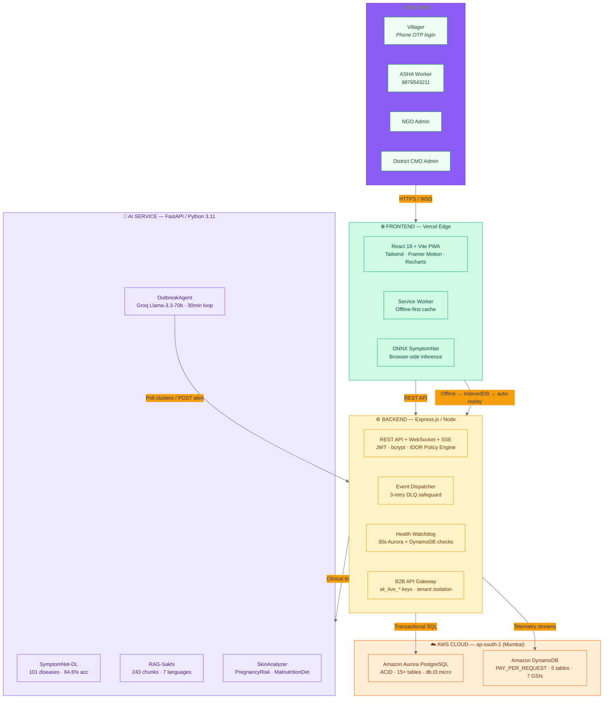
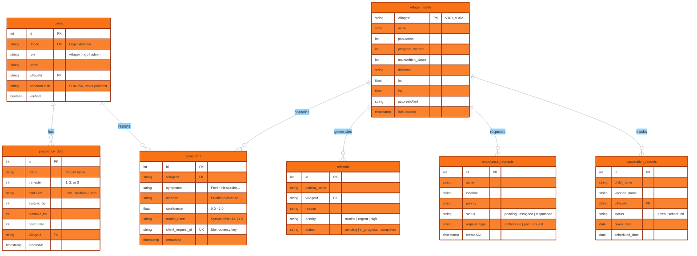

# System Architecture — SwasthAI Guardian Platform

> Cloud-native rural health intelligence built on **Amazon Aurora PostgreSQL**, **Amazon DynamoDB**, and **FastAPI AI agents**. Four-tier architecture designed for zero-connectivity resilience, ACID medical records, and millisecond outbreak alerts.

---

## 30-Second Architecture Overview



---

## Tier Breakdown

| Tier | Platform | Core Role | AWS Integration |
|---|---|---|---|
| **Client Edge** | Vercel · React 18 · Vite PWA | Offline-first clinical UI with ONNX browser inference | S3 pre-signed URLs for photo upload |
| **API Gateway** | Render · Express.js · Node 20 | REST API, WebSocket telemetry, SSE alerts, B2B gateway | Aurora connection pool + DynamoDB SDK |
| **AI Service** | Render · FastAPI · Python 3.11 | SymptomNet, RAG-Sakhi, OutbreakAgent, clinical guardrails | Groq Cloud (external LLM) |
| **Data Layer** | **Amazon Aurora PostgreSQL** + **Amazon DynamoDB** | ACID medical records + NoSQL telemetry event store | AWS ap-south-1 · IAM auth |

---

## AWS Data Architecture

### Why Two Databases?

| | **Amazon Aurora PostgreSQL** | **Amazon DynamoDB** |
|---|---|---|
| **Chosen for** | ACID compliance — a corrupted pregnancy record could cost a life | Millisecond writes — a disease cluster must be recorded instantly |
| **Access pattern** | Relational joins, aggregations, transactional reads/writes | Append-only streams, time-series queries, key-value lookups |
| **Data stored** | Users, pregnancies, symptoms, referrals, vaccinations, schemes | Outbreak telemetry, sync queues, village heartbeats, emergency streams |
| **Scaling** | Vertical — db.t3.micro → r6g.large | Horizontal — PAY_PER_REQUEST, unlimited throughput |
| **Connection** | `pg.Pool { max: 20 }` · SSL · 30s connection timeout | AWS SDK v3 · IAM keys · `ap-south-1` |

### Aurora PostgreSQL Schema (Core Clinical Tables)



> **15+ tables total** — includes `government_schemes` (20 MoHFW schemes), `district_config`, `api_keys`, `audit_logs`, `otps`, `malnutrition_data`, `asha_performance`, and more. Full schema: `backend/db/schema.js`.

### DynamoDB — 5 Tables, 7 GSIs, PAY_PER_REQUEST

| Table | PK | SK | GSIs / TTL | Purpose |
|---|---|---|---|---|
| **`outbreak_telemetry`** | `villageId` | `detectedAt` | `disease-index` · `district-time-index` · `gsikey-time-index` | AI-detected outbreak clusters by disease, district, and time range |
| **`sync_queues`** | `deviceId` | `queuedAt` | `status-index` | Offline client sync logs during signal outages |
| **`village_node_state`** | `villageId` | — | `all-nodes-index` · TTL: 7 days | Live village heartbeat map — auto-expires stale nodes |
| **`emergency_streams`** | `districtId` | `streamId` | `priority-index` · `district-date-index` | P1 SOS ambulance audit trail with chronological paging |
| **`security_audit_logs`** | `actor` | `timestamp` | None (access isolation) · TTL: indefinite | DISHA 2023 compliance — cross-actor scanning blocked |

### Production Hardening Applied

| Fix | Naive Approach | Production Implementation |
|---|---|---|
| **Scan → Query** | `Scan` on entire table | `district-time-index` Query — bounded reads at scale |
| **Dynamic districtId** | Hardcoded `'district_main'` as PK | `getDistrictId(db, villageId)` resolves real district via Aurora join before every DynamoDB write |
| **Atomic UpdateCommand** | `PutCommand` (race conditions) | `UpdateCommand` — patches only 4 owned fields, safe under concurrent writes |
| **GSI Validation** | Assumed GSIs exist (silent failures) | `DescribeTableCommand` on startup — fails loudly if GSI missing |
| **Idempotent TTL** | `setTimeout(() => ...)` (duplicate runs) | `ensureTTL()` checks `ENABLED|ENABLING` — safe to re-run on every restart |

---

## Key Differentiators

### 1. Offline-First PWA with Browser-Side AI
ONNX SymptomNet runs in-browser with zero network. IndexedDB queues all submissions during signal outages and auto-replays on reconnect. SHA-256 local auth works offline. 7-language voice I/O for non-literate users. Photos compress to <200KB for 2G uploads.

### 2. Autonomous Outbreak Agent (Closed-Loop)
Every 30 minutes: OutbreakAgent queries Aurora for village symptom clusters → sends to Groq Llama-3.3-70b (JSON mode, 3-attempt exponential backoff) → if confidence ≥ 70%: checks DynamoDB 24h dedup → POSTs alert → DynamoDB write + SSE broadcast → Admin dashboard shows live Outbreak Radar with AI reasoning trace.

### 3. B2B API Gateway with Tenant Isolation
Admin panel generates `sk_live_*` keys scoped to `tenantId = districtId`. All queries enforce `WHERE "districtId" = ?`. Usage tracking (`usage_count` + `last_used_at`) per request. Endpoints: `/api/b2b/villages`, `/api/b2b/analytics`, `/api/b2b/ambulances`, `/api/b2b/outbreaks`. B2BUsageDashboard for partner NGOs.

### 4. Predictive Village Risk Intelligence
4-signal weighted engine: Symptom Trend Growth (40%) + Outbreak Proximity (25%) + NVBDCP Seasonal Calendar (20%) + Referral Backlog (15%). Output: Village Risk Score 0-100 with district-wide heatmap (GREEN → AMBER → RED) and XAI contributor bars in the admin dashboard.

---

## Runtime Resilience (Free Tier Architecture)

Since both services run on Render free tier (spindown after 15 min idle), the backend automatically falls back to **SQLite** with zero data loss when Aurora is paused:

```text
Cold start:
  Aurora 30s timeout → SQLite fallback → full schema + demo data seeded
  Aurora resumes → transparent reconnect → db swapped back at runtime
```

Health endpoint: `{"db": "connected" | "SQLite fallback" | "degraded", "dynamodb": "connected" | "mock"}`

---

> **Why this matters**: Rural health infrastructure cannot afford data corruption or high cloud costs. Aurora PostgreSQL guarantees ACID safety for every pregnancy record and medical referral. DynamoDB PAY_PER_REQUEST provides millisecond outbreak alerting with zero provisioning. Together, they deliver hospital-grade data integrity at village-scale cost.
