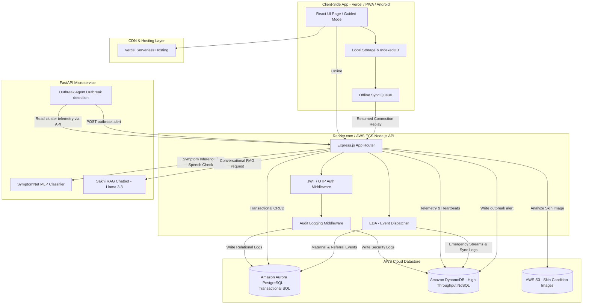
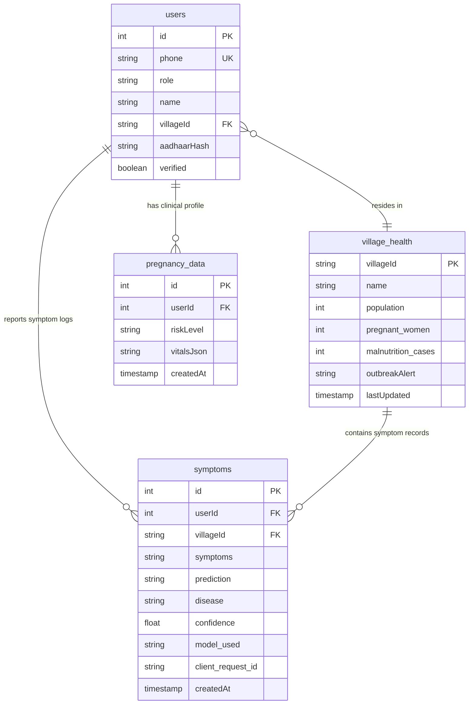

# 🏗️ System & Database Architecture — SwasthAI Guardian Platform

This document describes the high-level system architecture and database design decisions of the SwasthAI Guardian Platform, illustrating how offline-first clients, backend APIs, relational databases, NoSQL event stores, and AI microservices interact.

---

## 🏗️ High-Level Architectural Flow

The diagram below details the end-to-end data lifecycle, displaying how offline inputs sync dynamically and route to AWS databases:



---

## 📦 Component Roles

1. **Client Layer (Vercel / PWA / Android)**:
   - Built with React & Vite, hosted on Vercel. 
   - Uses an **Offline Event Replay Engine** powered by IndexedDB to log events (symptoms, pregnancies, emergencies) when offline and replay them automatically on reconnection.
   - Leverages on-device image compression (shrinking high-res image inputs to `<200KB` on-the-fly) to support reliable uploads on slow 2G/EDGE networks.
   - Executes browser-side ONNX SymptomNet classification and offline RAG fuzzy matching when connectivity is lost.
   - Hashes offline-cached user login passwords using a secure SHA-256 implementation.
   
2. **Backend API Service (Express.js)**:
   - Handles route validation, auth checks, and asynchronous audit logs.
   - Hosts the centralized **`policy.js` IDOR & Role Policy Module** (`checkRole`, `enforceVillageScope`, `enforceReferralAccess`, `enforceAmbulanceAccess`) — all 403 responses return a generic `{ code: 'ACCESS_DENIED' }` body to prevent role/village scope leakage.
   - Hosts the local **Event Dispatcher** which processes **5 event types** out-of-band to keep route speeds fast: `symptom_submitted`, `outbreak_detected`, `sync_restored`, `emergency_triggered`, and `maternal_alert`. Each handler includes a **3-attempt retry loop** for DynamoDB writes. Failed events are persisted to a local **Dead Letter Queue** (`failed_events_dlq.json`, capped at 100 items) and broadcast as a `dlq_alert` SSE event to admin clients. Admins can inspect the DLQ via `GET /api/admin/dlq`.
   - Runs a **Health Watchdog Monitor** every 30 seconds to check AI service status and verify Outbreak Agent heartbeat scans, dispatching warning feeds via SSE on failure.

3. **AI Microservice (FastAPI + Python)**:
   - **SymptomNet**: A multi-layered MLP Neural Network that evaluates symptom inputs with a heuristic local rules model acting as a fallback if the network is busy/offline.
   - **Sakhi Chatbot**: A Retrieval-Augmented Generation (RAG) assistant running Llama-3.3-70B over an expanded 243-chunk multilingual clinical database.
   - **Outbreak Agent**: An autonomous background daemon that requests village symptom clusters from the backend API, classifies them using Groq Llama-3.3 reasoning, checks for duplicates, and POSTs new outbreaks to the backend for DynamoDB storage and SSE broadcast.

---

## 🗄️ Database Strategy & AWS Design Decisions

Most apps use one database for everything. SwasthAI uses a hybrid approach: a local **SQLite** database as an offline edge node and local development fallback, paired with a dual **AWS Cloud** configuration in production.

### The Local/Edge Database Strategy (SQLite Fallback)
To ensure the app remains fully functional with zero initial setup for judges or developers, and to simulate offline client-side sync environments, SwasthAI utilizes an embedded **SQLite** engine. 
* **Local Dev & Evaluation**: When run locally without AWS credentials, the backend automatically boots with SQLite, using the exact same schema structure as our production Aurora database.
* **Production**: When deployed to cloud environments, the backend dynamically connects to **Amazon Aurora PostgreSQL** via the `DATABASE_URL` connection pool.

---

### The AWS Production Database Strategy (Aurora + DynamoDB)

| | Amazon Aurora PostgreSQL | Amazon DynamoDB |
|---|---|---|
| **Why chosen** | ACID compliance for permanent medical records | Millisecond write latency for high-velocity telemetry |
| **The stakes** | A corrupted pregnancy record could cost a life — ACID transactions are non-negotiable | A disease cluster alert must be written in < 10ms regardless of how many villages are reporting simultaneously |
| **Access pattern** | Transactional reads/writes, relational joins, aggregations | Append-only high-throughput streams, time-series queries |
| **Data stored** | Users, symptom submissions, pregnancies, ambulance requests, government schemes | Outbreak alerts, offline sync queues, village heartbeats, emergency dispatch logs |
| **Billing model** | Provisioned capacity (db.t3.micro → scales to r6g.large) | PAY_PER_REQUEST — auto-scales to millions of writes with zero provisioning |

---

### 📊 Relational Database ERD (Amazon Aurora PostgreSQL)

Aurora acts as the consistent transactional store. The relationship chain is designed as:
`users` → `village_health` → `pregnancy_data` → `symptoms`



---

### 📊 DynamoDB Table Design (Composite Keys + GSIs)

Every DynamoDB table is designed around specific access patterns to support zero-signal offline sync and rapid epidemic notifications:

#### 1. Table: `outbreak_telemetry`
Stores autonomous outbreak events classified by the Groq Llama-3 AI agent.
- **PK**: `villageId` (HASH) + **SK**: `detectedAt` (RANGE)
- **GSI: `disease-index`**: `disease` (HASH) + `detectedAt` (RANGE) — *Access Pattern: Query disease outbreaks by trend.*
- **GSI: `district-time-index`**: `districtId` (HASH) + `detectedAt` (RANGE) — *Access Pattern: Query district outbreak timeline.*

#### 2. Table: `sync_queues`
Manages the offline-first queue from ASHA workers' handheld devices.
- **PK**: `deviceId` (HASH) + **SK**: `queuedAt` (RANGE)
- **GSI: `status-index`**: `status` (HASH) + `queuedAt` (RANGE) — *Access Pattern: Fetch failed sync logs across the fleet.*

#### 3. Table: `village_node_state`
Real-time connectivity heartbeat for remote village nodes.
- **PK**: `villageId` (HASH)
- **TTL**: `expiresAt` — *Access Pattern: Stale nodes automatically expire after 7 days of inactivity.*

#### 4. Table: `emergency_streams`
Live, high-throughput ambulance dispatch and SOS events.
- **PK**: `districtId` (HASH) + **SK**: `streamId` (RANGE)
- **GSI: `priority-index`**: `priority` (HASH) + `streamId` (RANGE) — *Access Pattern: Filter critical P1 emergency alerts.*
- **GSI: `district-date-index`**: `districtDateBucket` (HASH) + `timestamp` (RANGE) — *Access Pattern: Page emergency events chronologically.*

#### 5. Table: `security_audit_logs`
Chronological tamper-evident database log of security actions.
- **PK**: `actor` (HASH) + **SK**: `timestamp` (RANGE) — *Access Pattern: Query security audits by acting administrator.*
- **GSI**: None — this table intentionally has no GSIs. All audit queries are actor-scoped (PK lookup), making cross-actor scans an explicit access-control boundary.
- **TTL**: None — audit records are retained indefinitely for compliance.

---

### DynamoDB Production Hardening (5 Fixes Applied)

| Fix | Before (naive) | After (production-grade) |
|---|---|---|
| **Scan → Query** | Broad table reads for command-center proof | `outbreak_telemetry.district-time-index` and `emergency_streams.district-date-index` provide bounded district/time `Query` access |
| **Dynamic districtId** | Hardcoded `'district_main'` as partition key for all records | `getDistrictId(db, villageId)` — resolves the real district via PostgreSQL join before every DynamoDB write |
| **Atomic UpdateCommand** | Full `PutCommand` on every update — race condition risk under concurrent writes | `UpdateCommand` patches only 4 owned fields — safe to call in parallel, never overwrites concurrent writes |
| **GSI Validation** | Assumed GSIs existed at runtime (silent failure if missing) | `DescribeTableCommand` on startup — compares actual vs. required GSI names; fails loudly if missing |
| **Idempotent TTL** | `setTimeout(() => UpdateTimeToLive(), 5000)` — could run multiple times | `ensureTTL()` checks for `ENABLED\|ENABLING` state before calling — idempotent and safe to re-run |

---

### The Agentic Outbreak Loop (What No Other Submission Has)

This is a fully autonomous AI agent running as a background service — not a dashboard a human checks:

```
Every 30 minutes →
  OutbreakAgent queries Aurora PostgreSQL for village symptom clusters
  → Sends cluster JSON to Groq Llama-3.3-70b with JSON mode + 3-attempt exponential backoff
  → If LLM confidence ≥ 70%:
      Checks DynamoDB to ensure no duplicate alert exists for this village in the last 24h
      → POST to /api/admin/outbreak-alert (fails loudly at startup if AGENT_SECRET is missing)
      → Backend writes to DynamoDB outbreak_telemetry (villageId + detectedAt, with districtId for district-time GSI)
      → SSE broadcast to all connected admin dashboard sessions
      → Admin sees live Outbreak Radar update with AI reasoning trace and disease name
```

---

### PostgreSQL Schema Reference

The relational database models the full lifecycle of a rural patient's health journey:

* **`users`** — Demographic records with Aadhaar hashes (never plaintext), caste/BPL status for automatic government scheme eligibility matching.
* **`village_health`** — Patient symptom submissions linked to district geography (lat/lng + districtId) for outbreak detection.
* **`maternal_health`** — Clinical pregnancy metrics (blood pressure, blood sugar, weight, trimester) with dynamic risk-level classification (Low / Medium / High).
* **`malnutrition_cases`** — Child height/weight measurements mapped to SAM (Severe Acute Malnutrition) and MAM (Moderate Acute Malnutrition) WHO classifications.
* **`government_schemes`** — Structured JSON metadata for rural health schemes (JSY, PMMVY, Ayushman Bharat) with eligibility query parameters.
* **`ambulance_requests`** — SOS emergency event triggers with coordinate-based tracking and outcome logging.
* **`vaccination_records`** — Mission Indradhanush immunization schedule and status tracking per child.
* **`district_config`** — Per-district custom thresholds, emergency contact numbers, and automation parameters.

---

> **Why this matters to AWS Judges**: Rural health infrastructure cannot afford either data corruption or high cloud costs. By routing critical medical records to ACID-compliant **Aurora PostgreSQL** and streaming high-frequency alerts to **DynamoDB (on-demand)**, we guarantee 100% data durability and single-digit millisecond latency while keeping operating costs close to zero.
